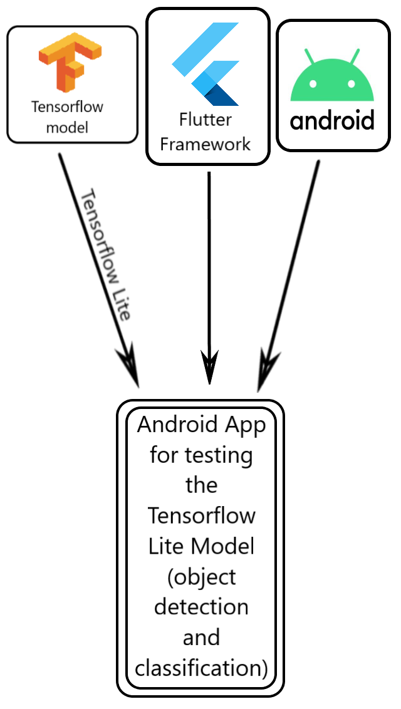
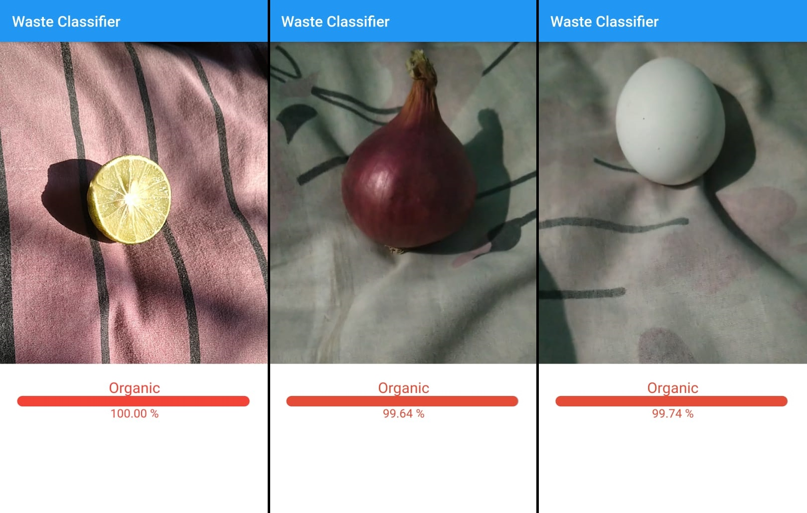
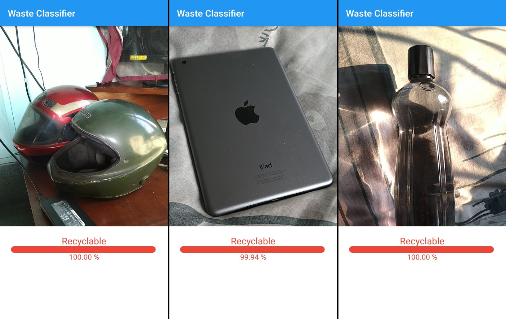

# Waste-Classifier
-------------------------

An app built to classify waste/garbage into organic waste or recyclable waste.
The app was built using the Flutter framework. It uses a Neural Network model created using Tensorflow and converted to Tensorflow Lite.

## Architecture
-----------------------

## Screenshots
--------------------------

### Organic

### Recyclable

